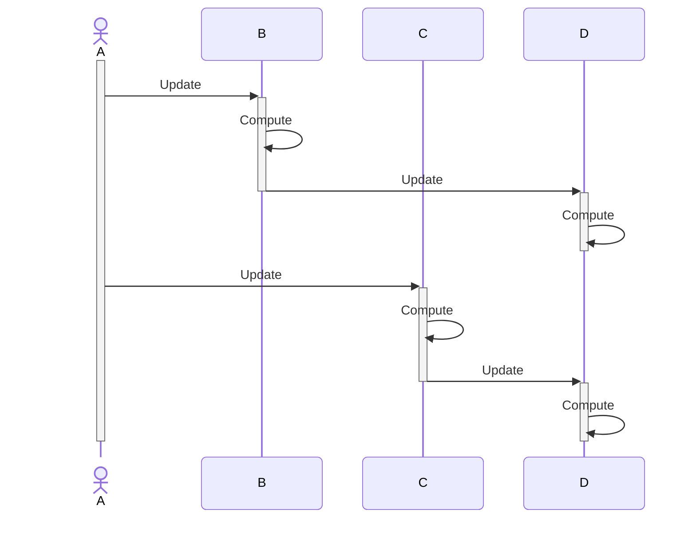
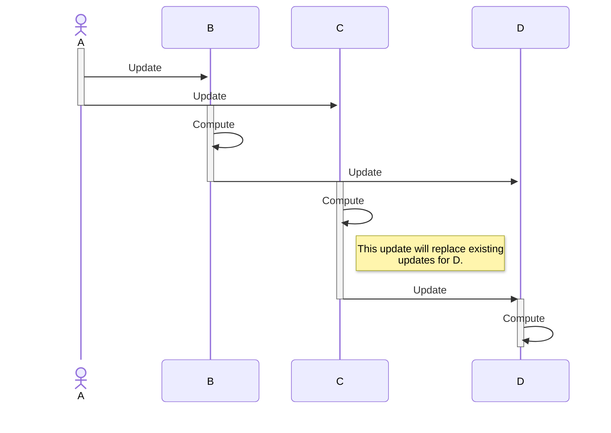

# KReactive Test

A simple test implementation of a simple reactive framework purely written in Kotlin.

The advantage of using such framework is the handy way to define observers on top of
observable values, which can have two very distinct behaviours:
- **Push** model: when the source updates, it actively notifies its observers triggering a recomputation.
- **Pull** model: when the source updates, it notifies its observers that their value is stale. The
value recomputation is triggered only when the value is requested to the observers.

The framework is ergonomic in the way dependencies are resolved between sources and observers. More specifically,
we can disnguish between:

- *Source* is a value provider that notifies both lazy and eager subscribers.
- *Observer* is a computation that is run upon receiving updates from the observing sources.
- *Signal* is a computation that is run and cached when its value is required, invalidating its cache when any observed source chages.

In this setting, the framework performs an automatic "wiring" of dependencies based on which sources or observers/signals are
used and accessed inside the computation block of an observer or signal.
This framework allows the following depdendencies:

- Observer --depends--> Source
- Signal --depends--> Source
- Observer --depends--> Observer
- Signal --depends--> Signal
- Signal --depends--> Observer
- Observer --depends--> Signal: this is a special dependency and it's up to the designer to allow such dependencies or not, because having a pull depdendency on a push computation
  will break the lazy contract of the pull dependency.

With automatic dependency management, the problem of detecting and properly handling **stale dependencies** is crucial.
Consider the following example:

```kotlin
a = source(10.0)
b = source("Hello")
cond = source(true)

obs = Observer {
  if (cond) print(a) else print(b)
}

a = 20.0
// 20.0
cond = false
// Hello
a = 15.0
// Hello <-- Wrong!
```

The problem of stale dependencies in this case is due to the conditional dependency. In the above example, when re-evaluating
`obs` computation, we should have detected that `a`'s value is no more needed and we can remove its dependecy. Not doing this
will re-trigger `obs` computation when `a`'s value changes even though we are no more depending on that value.
The approach taken by this framework takes
inspiration from *SolidJS* version concept and the lazy dependencies unlinking of various reactive frameworks (e.g. MobX, Vue and Svelte), where for each computation we keep track of an "epoch number".
Each computation holds an epoch number that states when its being computed/accessed (`lastRunEpoch`). Each computation holds for each dependency (i.e. subscribers) the last epoch
number it has been accessed. In this way, we consider a dependency as *active* iff the last epoch number it has been accessed is equal to the actual `lastRunEpoch` of the
dependency itself. Otherwise the dependency is stale, and we can remove the link from the dependency and the current computation, as the dependant did not accessed current computation's
value in its last run. 

Moving the stale dependencoies pruning on the "sender" side (on the source of updates), amortizes the cost of stale dependencies detection and removal, effectively achieving a lazy unlinking, i.e.
unlinking to dependants only when notifying them. This can lead to better performance compared to checking for stale dependendencies every time a computation runs (checking for dependencies
staleness on "receiver" side each time).

A handy DSL which takes advantage of kotlin's delegated properies is defined, making it possibile to specify the following code:

```Kotlin
var value by source(10.0)

val doublingValue by eagerObserving {
  (value * 2).also { println("[eager] - $it") } 
}
// "[eager] - 20.0" - printed right away

val powValue by lazyObserving {
  (value * value).also { println("[lazy] - $it") }
}

value = 2.0
// "[eager] - 20.0" - observers eagerly recomputes

println("Value of square root of lazy evaluation: ${sqrt(powValue)}")
// "[lazy] - 4.0" - printed by lazy, computation triggered on value request
// "Value of square root of lazy evaluation: 2.0"
```

## Some Problematic Topologies

Some topologies exploited and suggested some considerations in how the components are designed and implemented. The biggest source
of complexity in this design is mainly due to these three topologies and the problems they highligh.

### Circular Dependencies

```kotlin
lateinit A
lateinit B
A = Observer { B }
B = Observer { A }

┌────────────────┐
│                ▼
A                C
▲                │
└────────────────┘
```

This kind of dependency should be detected and prohibited, because an update in either `A` or `B` will trigger a infinte set of updates (leading to
a *Stack Overflow* error).

When automatically resolving dependencies in the `DependencyTracker`, a custom stack is being used to track current computations that are being
executed: this stack simply has all stack's properties (i.e. ≃ O(1) insertion, O(1) top removal), while granting a constant time access for membership checks.
By using such structure, no duplicate entries can be pushed in the stack, and if so happens, a circular dependency is detected and the system fails.

### Double Source Topology

```kotlin
A = source
B = Observer { A }
C = Observer { A, B }

 ┌───────►B───────┐
 │                │
 │                ▼
 A ─────────────► C
```

In a naive implementation, we must address the problem of updating C twice, one update coming from A and one from B.

The solution includes a `level` field in all `Subscriber`s which they will indicate the level they are sitting in the dependency graph.
Thanks to this level, when evaluating the nodes for computation we can sort them topologically thanks to this field. In the above example
we'll have (sources level is always equals to 0):

```kotlin
A.level = 0
B.level = 1
C.level = 2
```

The dependencies of a computation must have a level >= than the computation's + 1, i.e.
```kotlin
dep.currentLevel = max(dep.currentLevel, computation.level + 1)
```

With this approach we will schedule the execution corretly, namely A then B and ultimately C.

### Diamond Topology

```kotlin
A = source
B = Observer { A }
C = Observer { A }
D = Observer { B, C }

┌──────►B──────┐
│              ▼
A              D
│              ▲
└──────►C──────┘
```

Eager computations does not complete until all their eager dependats update. Because of this, the updates in the above example will be
performed as (notation note: actors are sources while participants are observers):



With this exectution, D computes twice: the first execution uses B's updated data but with C's stale data, whereas in the second run
both values are updated.

In order to avoid executing useless runs, we must make observers computations' end before their dependants. For this reason a 
"trasaction set" is being used when we track and update dependencies. We defer and execute later dependants computations, which
can in turn push in the stack other computations. Being a set (an access-sorted hashmap in the actual implementation), if there is a duplicated
computation, only the last inserted is kept.

With this approach, once a source is updated, the computations of its observers is performed as:


